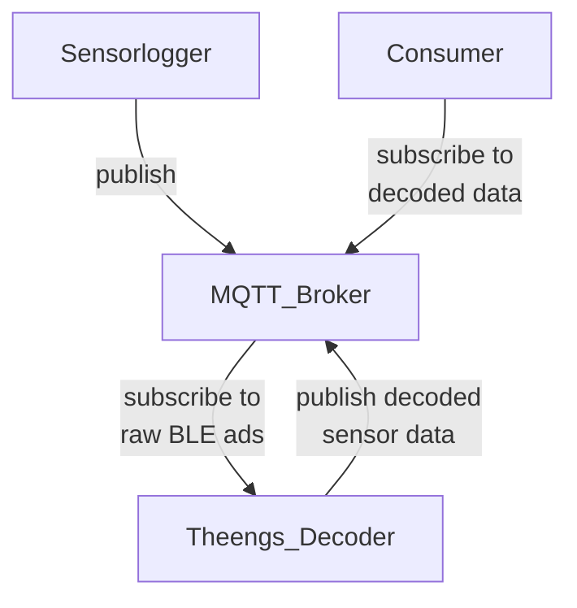

# Theengs BLE decoder integration

This could be done in a separate process on the broker host which 
- subscribes to BLE sensor data published by sensorlogger
- decodes the BLE adds
- publishes ads

